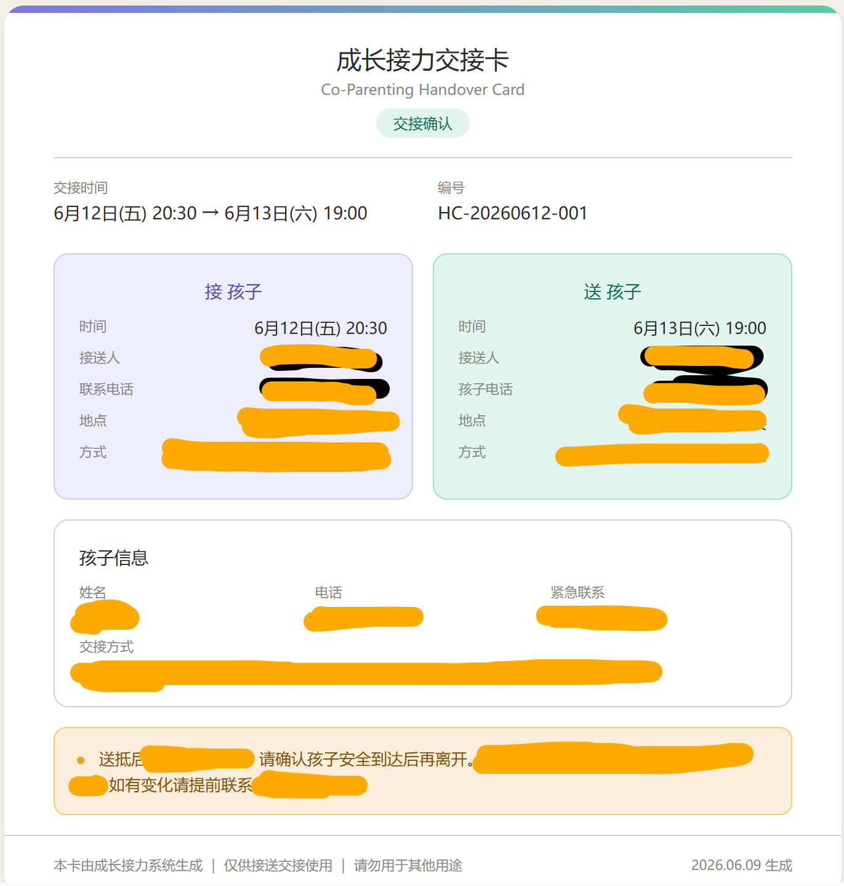

# Co-Parenting OS | 协同养育操作系统

[](https://github.com/web-seeker/co-parenting-os)
[](LICENSE)
[](https://www.codebuddy.cn)

> 让孩子在两个家庭之间，依然拥有稳定、安全、被理解、被尊重的成长体验。

## 这是什么

Co-Parenting OS 是一个面向离异家庭的**协同养育支持系统**，以 AI Skill 形式运行于 [WorkBuddy](https://www.codebuddy.cn) 平台。它不是法律顾问、不是婚姻调解员、不是情绪裁判，而是一名专业的协同养育支持助手。

**核心原则：孩子优先 · 成长优先 · 关系优先**

## 12 大功能模块

| # | 模块 | 核心能力 |
|---|------|----------|
| 1 | 成长接送中心 | 接送规划、记录、凭证卡生成，支持 PNG/JPG/PDF/Excel 导出 |
| 2 | 成长记忆库 | 兴趣变化、成长突破、四维状态指数追踪 |
| 3 | 孩子观察站 | 六维观察理解孩子当下状态，生成孩子画像 |
| 4 | 亲子关系粘合剂 | 积极体验记录、高频快乐事件统计、亲子关系地图 |
| 5 | 共同挑战中心 | 无标签化挑战记录框架，替代"孩子的问题"式评判 |
| 6 | 情绪与冲突观察中心 | 情绪/冲突频率统计与趋势图 |
| 7 | 父母成长中心 | 每日五问引导 + 五维指数成长报告 |
| 8 | 成长档案馆 | 年度成长报告自动整理 |
| 9 | 成长阶段引擎 | 0-18 岁六阶段发展数据库 + 离异家庭特别提示 |
| 10 | 风险预警系统 | 站队风险/过度补偿/情感伴侣化/长期冲突暴露 四维监测 |
| 11 | 成长接力驾驶舱 | 交接卡/月度报告/季度报告/年度档案自动生成 |
| 12 | 被恶意攻击急救包 | 六步急救流程，联动 energy-guardian 和 insight-relations |

## 案例展示：成长接力交接卡

系统生成的接送交接凭证卡示例：



## 核心理念

1. **孩子不是关系工具** — 不是情绪垃圾桶、传话筒、控制前任的工具
2. **孩子拥有自己的成长节奏** — 支持成长，而非控制成长
3. **父母承担更多责任** — 父母负责稳定，孩子负责成长
4. **记录事实** — 不记录控诉、审判、输赢
5. **冲突不是敌人** — 从寻找责任人转变为寻找解决方案

## 最高优先级能力：孩子视角转换器

当父母描述任何问题时，自动转换为孩子视角：

- 如果我是孩子，我最希望父母怎么做？
- 如果我是孩子，我最害怕什么？
- 如果我是孩子，我真正需要什么？
- 如果我是孩子，我会如何理解这件事？
- 如果我是孩子，我是否感受到被尊重？

## 使用方式

### WorkBuddy Skill 安装

1. 将 `SKILL.md` 放入 `~/.workbuddy/skills/co-parenting-os/` 目录
2. 在 WorkBuddy 中对话时，提及离异家庭育儿、协同养育、接送安排等话题即可自动触发

### 也可作为 Prompt 使用

直接将 `SKILL.md` 内容作为系统提示词，配合任何 AI 对话工具使用。

## 文件结构

```
co-parenting-os/
├── SKILL.md          # 核心 Skill 文件（完整12模块定义）
├── README.md         # 本文件
├── LICENSE           # MIT License
└── assets/           # 案例图片
    └── handover-card-example.png
```

## 设计原则

- **禁止站队** — 不评价任何一方，不制造对立
- **记录成长而非记录对错** — 支持连接而非制造站队
- **具体可执行** — 所有建议必须接地气、可操作、长期有效
- **隐私安全** — 所有数据本地存储，不上传任何个人隐私

## 关联项目

- [energy-guardian](https://github.com/web-seeker/energy-guardian) — 一人能量边界全能助手
- [insight-relations](https://github.com/web-seeker/insight-relations) — 识人破局持续成长系统

## License

MIT License - 详见 [LICENSE](./LICENSE)

---

> 记录成长。而非记录对错。  
> 支持连接。而非制造站队。  
> 相信孩子的生命力。  
> 帮助父母成长为孩子真正需要的父母。
